# 🔥 Актуальные тренды (март 2026)

## Топ тренды по популярности

### 1. DeepSeek — главный хит (тренд 75-80)
- deepai: 1100% рост
- deepseek r2: 190% рост
- "deepseek на русском": 60% рост

### 2. MCP (Model Context Protocol) — взрывной рост
- Связанные запросы: 428,950 (!)
- Стабильный рост: 32-34

### 3. Claude Code — растущий тренд
- "install claude code": 419,950
- "claude code vs cursor": 237,200
- "claude code vs codex": 129,250

### 4. AI Agents — стабильный интерес (60-61)

---

## 📝 Рекомендации для статей

### 🔥 Гарантированный трафик (высокий спрос, мало конкуренции)

#### 1. "DeepSeek vs Codex vs Claude — что выбрать в 2026"
- Тренд: DeepSeek 80, Codex ~30, Claude ~8
- Сравнение бесплатного vs платного
- Рабочие способы доступа из России

#### 2. "MCP (Model Context Protocol) — полное руководство 2026"
- Огромный спрос (428k запросов!)
- Ваша текущая статья про MCP получает 26 просмотров
- Нужна статья-гайд: что это, зачем, примеры

#### 3. "Как установить Claude Code — пошаговая инструкция"
- 419k запросов на установку
- Для Windows/Mac/Linux
- Настройка, первые шаги, примеры

#### 4. "Claude Code vs Cursor vs Kilo Code — битва AI-редакторов"
- Сравнение по цене, функциям, скорости
- Для кого что подходит
- Рекомендации для России

### 📈 Средний потенциал (стабильный спрос)

#### 5. "DeepSeek R2 — новая эра бесплатного AI-кодинга"
- Тренд на R2: 190%
- Что изменилось vs R1
- Как использовать в проектах

#### 6. "AI-агенты для разработки — 2026"
- Стабильный тренд 60+
- Обзор инструментов
- Практические кейсы

#### 7. "LLM для программирования — сравнение 2026"
- Общий тренд LLM: 77
- Цены, лимиты, скорость
- Рейтинг для российских разработчиков

---

## 🎯 Мой выбор (приоритет)

### Приоритеты контента (матрица популярность/конкуренция)

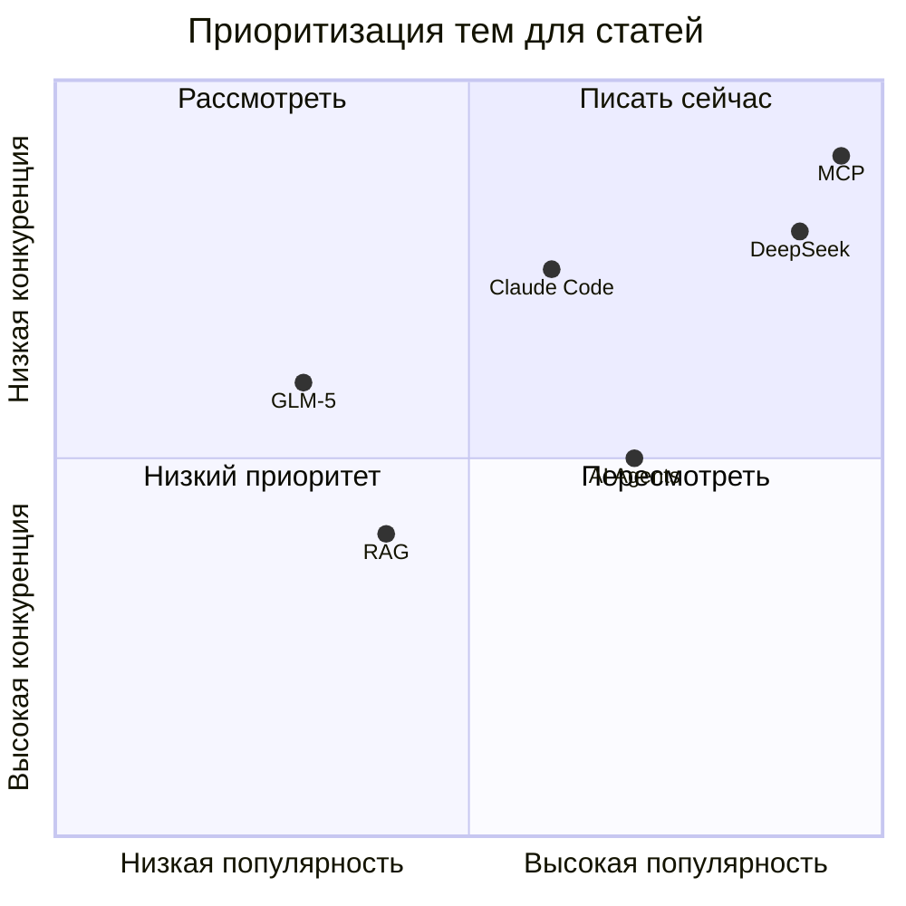

### Статья №1: "DeepSeek vs Codex Pro — бесплатная альтернатива в 2026"

**Почему:**
- Максимальный тренд (80)
- Конкуренция низкая
- Актуально для России
- Привяжется к вашей статье про Codex

**Структура:**
1. Почему DeepSeek взрывает рынок
2. Сравнение с Codex Pro (цена/качество)
3. Как начать работу
4. Реальные примеры кода
5. Итог: когда что использовать

### Статья №2: "MCP за 10 минут — от теории к практике"

**Почему:**
- Аномальный спрос (428k)
- Низкая конкуренция
- Техническая тема = ваш стиль
- Привяжется к текущей статье про MCP

---

## 💡 Контент-план на месяц

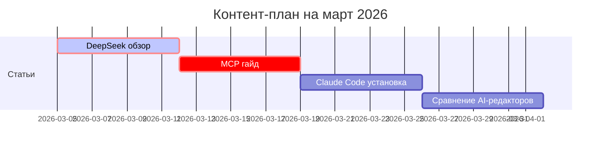

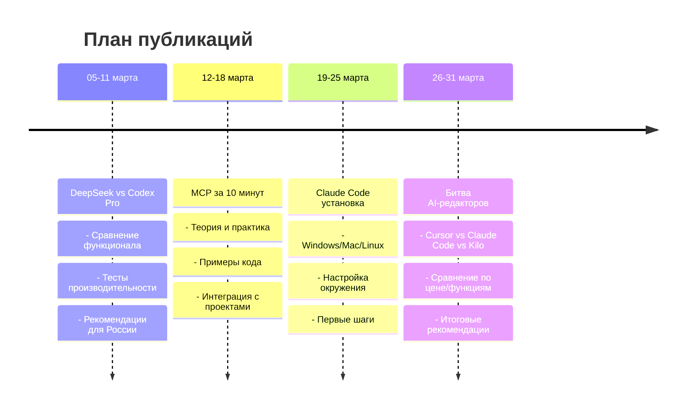

1. **DeepSeek обзор** (сейчас)
2. **MCP гайд** (через неделю)
3. **Claude Code установка** (через 2 недели)
4. **Сравнение AI-редакторов** (в конце месяца)

---

## 📊 Данные из Google Trends (март 2026)

### Сравнение LLM моделей (RU, 3 месяца)

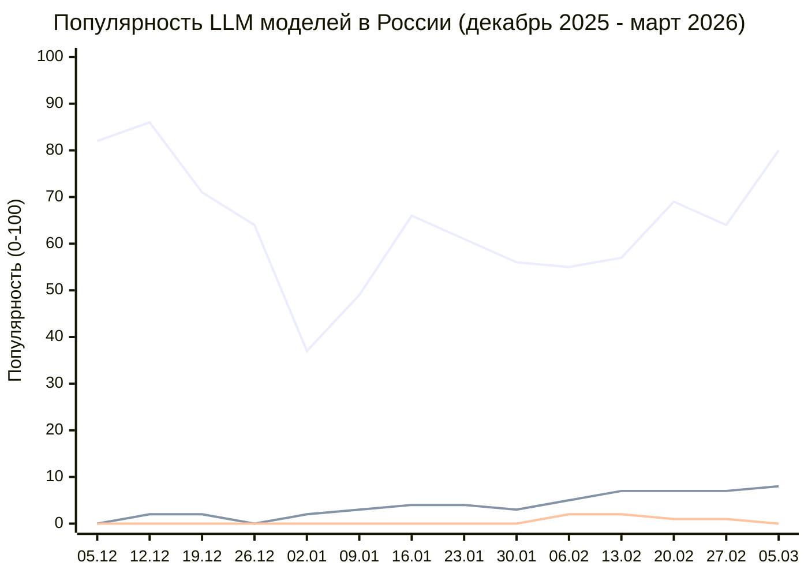

| Модель | Тренд (5 марта) | Динамика |
|--------|-----------------|----------|
| DeepSeek | 80 | ↗️ рост |
| Claude Code | 8 | ↗️ рост |
| GLM-5 | 0 | ➡️ стабильно |

### Технологии (RU, 3 месяца)

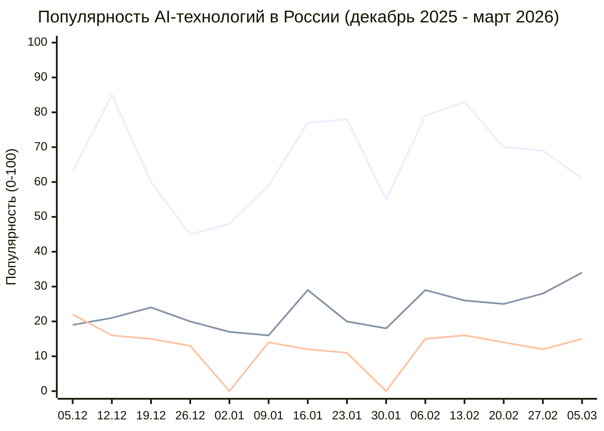

| Технология | Тренд (5 марта) | Динамика |
|------------|-----------------|----------|
| Agent | 61 | ↗️ рост |
| MCP | 34 | ↗️ рост |
| RAG | 15 | ↗️ рост |

### Связанные запросы DeepSeek

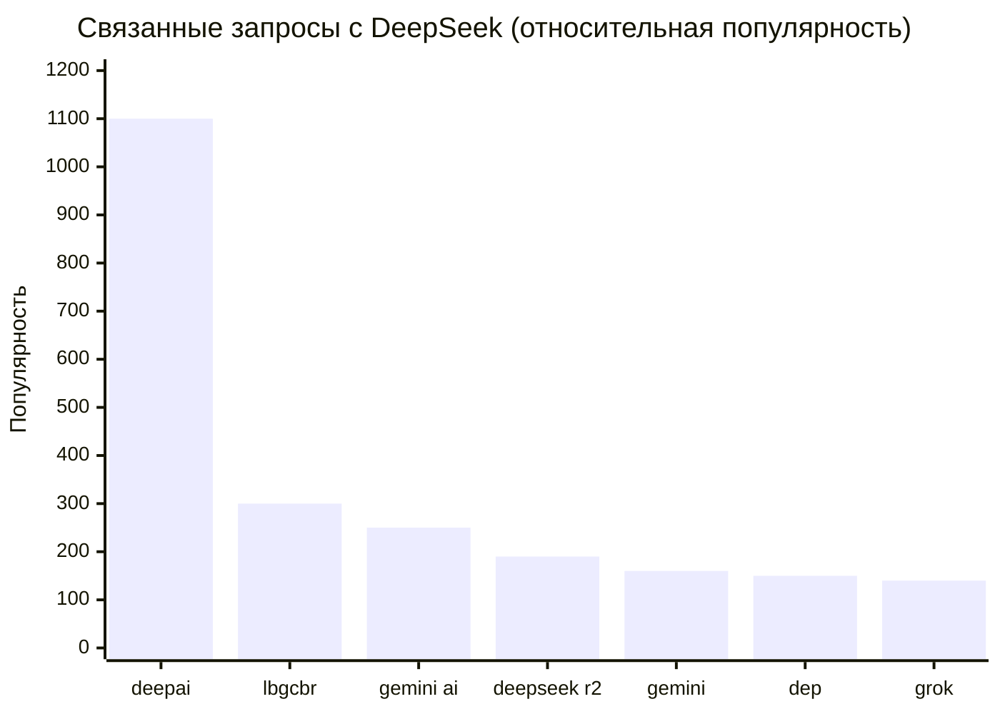

| Запрос | Значение |
|--------|----------|
| deepai | 1100 |
| deepseek r2 | 190 |
| gemini ai | 250 |
| deepseek на русском | 60 |

### Связанные запросы Claude Code

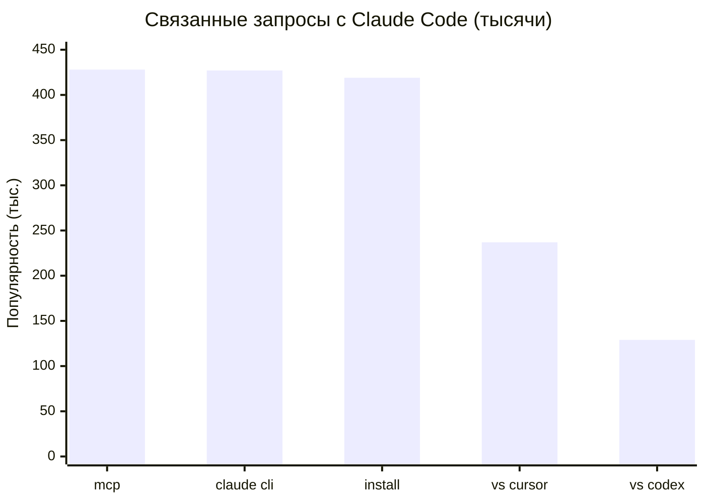

| Запрос | Значение |
|--------|----------|
| mcp | 428,950 |
| claude cli | 427,200 |
| install claude code | 419,950 |
| claude code vs cursor | 237,200 |
| claude code vs codex | 129,250 |

---

## 📈 Анализ текущего трафика prikotov.pro

### Топ страницы (январь-февраль 2026)

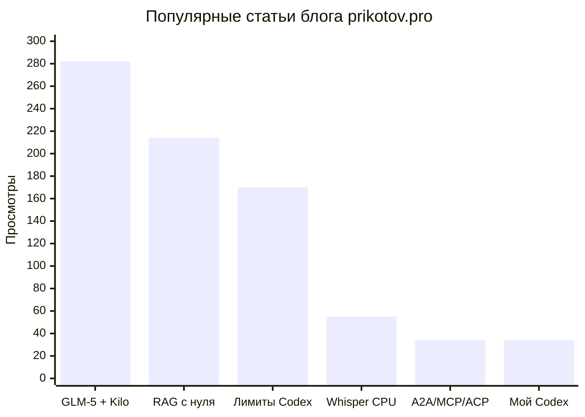

| Страница | Просмотров | Посетителей |
|----------|-----------|-------------|
| GLM-5 + Kilo Code | 282 | 191 |
| RAG с нуля | 214 | 131 |
| Лимиты Codex | 170 | 131 |

### Источники трафика

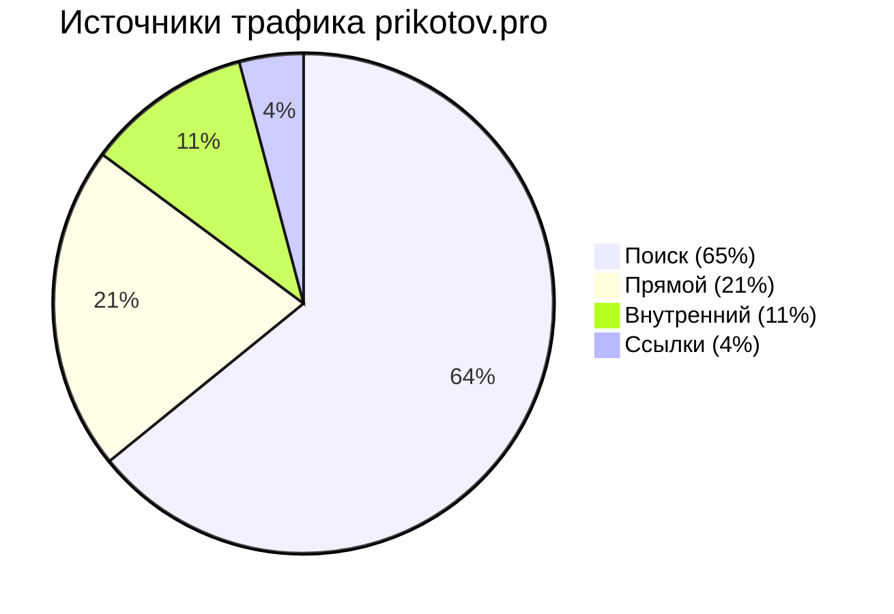

| Источник | Визиты | % от общего |
|----------|--------|-------------|
| Поиск | 635 | 65% |
| Прямой | 208 | 21% |
| Внутренний | 106 | 11% |
| Ссылки | 41 | 4% |

### SEO-потенциал (много показов, низкий CTR)

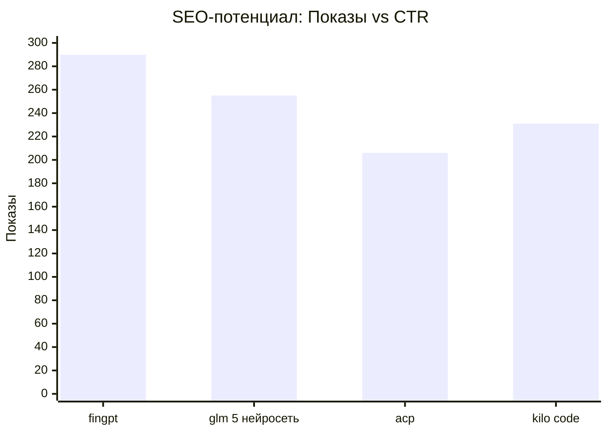

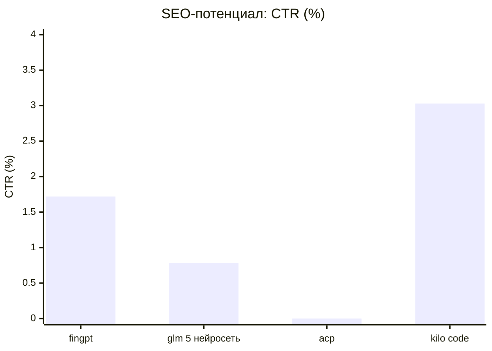

| Запрос | Показов | CTR | Позиция |
|--------|---------|-----|---------|
| fingpt | 290 | 1.72% | 8.3 |
| glm 5 нейросеть | 255 | 0.78% | 9.9 |
| acp | 206 | 0% | 8.2 |
| kilo code | 231 | 3.03% | 8.7 |

---

## 🎬 Следующие шаги

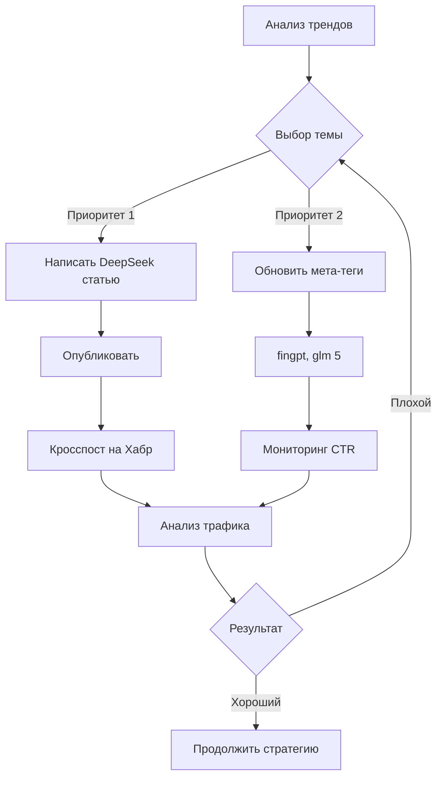

1. **Написать статью про DeepSeek** — максимальный приоритет
2. **Обновить мета-теги** для fingpt и glm 5 нейросеть
3. **Создать контент-план** на следующие 4 статьи
4. **Кросспост на Хабр** — увеличить охват

---

## 📊 Summary: Ключевые инсайты

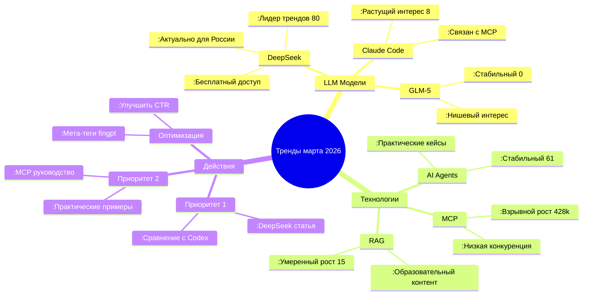

### Прогноз роста трафика

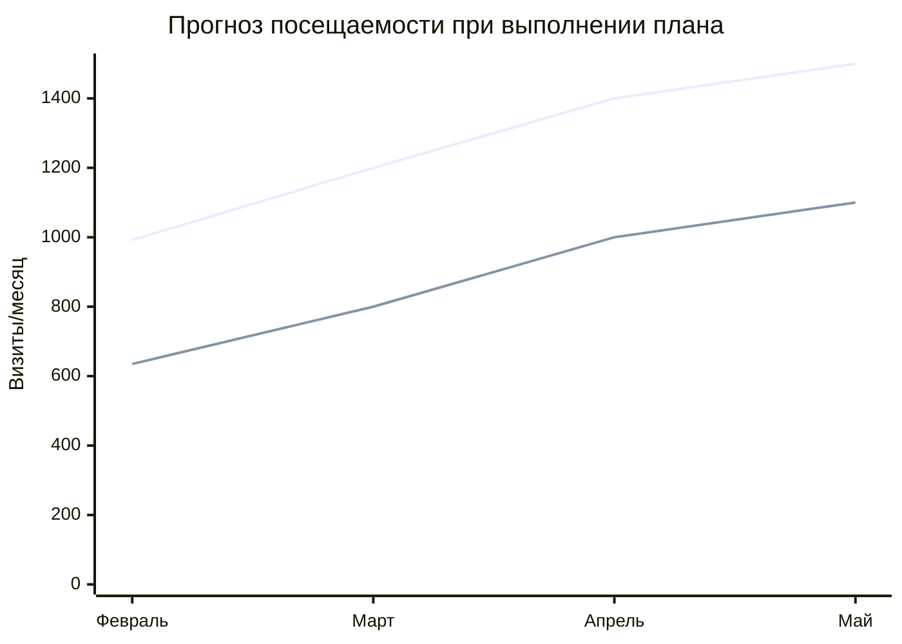

**Текущий трафик:** 992 визита/мес (65% поиск)
**Цель на май:** 1500 визитов/мес (+51%)

---

*Отчет сгенерирован: 5 марта 2026*
