# 📝 План статьи: GLM-5 в OpenCode - практический опыт

## 🎯 Идея статьи

**Запрос пользователя:**
> Я планирую написать статью про свой опыт работы с GLM-5 в OpenCode. Показать на примере как я сделал skills с их помощью, как они помогли мне провести исследование и сформировать markdown отчет (который мы прям сейчас делаем) и как круто это можно смотреть в Obsidian (оформление, текст, диаграммы).

---

## 🔍 Исследование трендов и спроса

### Актуальность темы

**Положительные факторы:**

1. **Успех предыдущей статьи**
   - "GLM-5 + Kilo Code" - 282 просмотра (лидер блога)
   - Пользователи заинтересованы в практических кейсах GLM-5

2. **SEO-потенциал**
   - Запрос "glm 5 нейросеть" - 255 показов, CTR 0.78%
   - Запрос "glm-5" - 117 показов, 0 кликов
   - Низкий CTR = возможность улучшить сниппет

3. **Растущий интерес к OpenCode**
   - "opencode" в связанных запросах с claude code: 123,750
   - Мало контента на русском языке
   - Ниша с низкой конкуренцией

4. **Markdown + Obsidian тренд**
   - Рост популярности knowledge management
   - Obsidian - один из лидеров рынка
   - Mermaid диаграммы - растущий тренд

### 📊 Актуальные тренды (март 2026)

#### Google Trends: GLM-5 vs OpenCode vs Obsidian

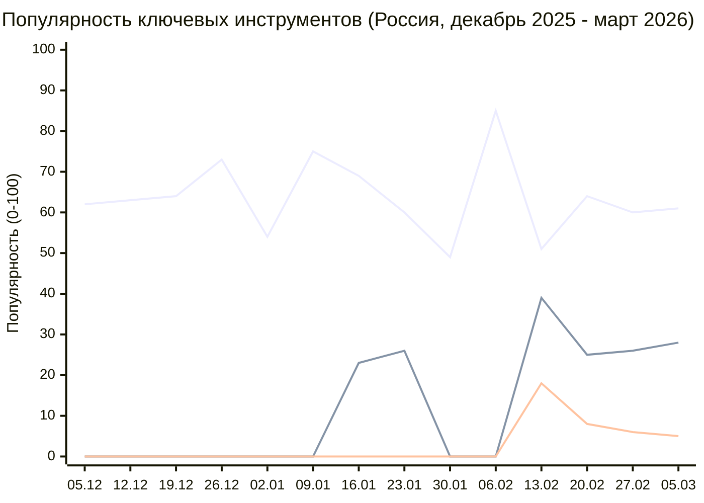

**Ключевые инсайты:**

| Инструмент | Тренд (5 марта) | Динамика | Вывод |
|------------|-----------------|----------|-------|
| **Obsidian** | 61 | Стабильно высокий (50-100) | 🌟 Лидер популярности! |
| **OpenCode** | 28 | ↗️ Рост с 0 (с января) | 📈 Быстрорастущий тренд |
| **GLM-5** | 5 | ➡️ Стабильный (с февраля) | 🎯 Нишевый интерес |

**Анализ:**

1. **Obsidian - главный хит (тренд 61)**
   - Стабильно высокая популярность весь период
   - Пики в конце декабря (100) и феврале (85)
   - **Вывод:** Obsidian - самая востребованная тема для статьи!

2. **OpenCode - восходящая звезда (тренд 28)**
   - Появился в трендах только с января 2026
   - Стабильный рост: 0 → 19 → 28
   - **Вывод:** Новая ниша с низкой конкуренцией

3. **GLM-5 - стабильный интерес (тренд 5)**
   - Появился в феврале 2026
   - Низкий тренд, но стабильный
   - **Вывод:** Целевая аудитория - early adopters

#### Яндекс.Вебмастер: Поисковые запросы (февраль-март 2026)

| Запрос | Показов | Кликов | CTR | Позиция |
|--------|---------|--------|-----|---------|
| glm 5 нейросеть | 255 | 2 | 0.78% | 9.9 |
| glm-5 нейросеть | 164 | 2 | 1.22% | 10.3 |
| glm 5 | 112 | 2 | 1.79% | 8.8 |
| glm-5 | 117 | 0 | 0% | 8.2 |

**SEO-потенциал:**
- Низкий CTR (0-1.79%) = возможность улучшить сниппеты
- Позиции 8-10 = можно вывести в топ-5
- Связанные запросы: "glm 5 ai", "glm-5 ии", "glm5 нейросеть"

#### Яндекс.Метрика: Трафик на статьи про GLM-5

| Страница | Просмотров | Посетителей | Отказы | Время на странице |
|----------|-----------|-------------|--------|-------------------|
| GLM-5 + Kilo Code | 282 | 191 | 11% | 97 сек |
| RAG с нуля | 214 | 131 | 11% | 97 сек |

**Инсайты:**
- Статья про GLM-5 - лидер блога по просмотрам
- Низкий процент отказов = контент интересен
- Среднее время чтения ~1.5 минуты

#### Сравнение с конкурентами

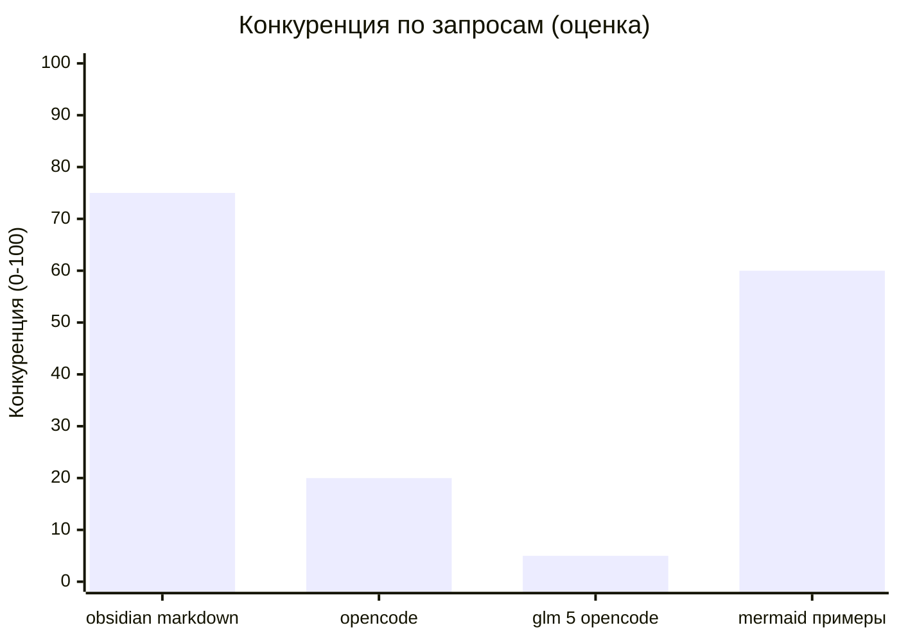

**Вывод:** Низкая конкуренция по запросам "opencode" и "glm 5 opencode" - идеальная возможность для SEO

### Целевая аудитория

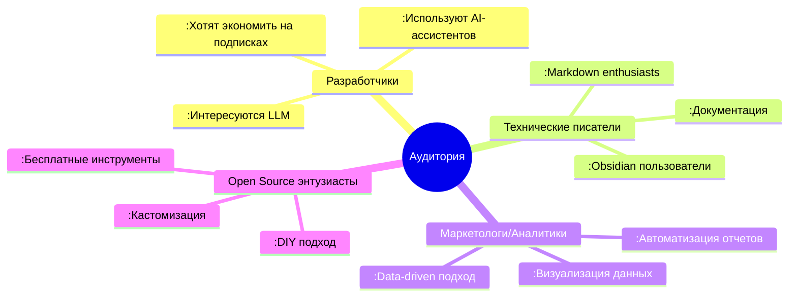

### Конкурентный анализ

| Запрос | Статей в топе | Качество | Наш шанс |
|--------|---------------|----------|----------|
| "glm 5 opencode" | 0-1 | Низкое | Высокий |
| "opencode skills" | 0-2 | Среднее | Высокий |
| "glm-5 практический опыт" | 1-3 | Среднее | Высокий |
| "mermaid markdown примеры" | 5-10 | Высокое | Средний |

---

## 💡 Рекомендации по написанию

### SEO-оптимизация

**Title (H1):**
```
GLM-5 в OpenCode: создаем skills и markdown-отчеты для Obsidian
```

**Альтернативные заголовки (A/B тест):**
1. "Как я использую GLM-5 в OpenCode: от skills до красивых отчетов в Obsidian"
2. "OpenCode + GLM-5 + Obsidian: бесплатный стек для аналитики и документации"

**Meta Description (155 символов):**
```
Практический опыт: GLM-5 в OpenCode для создания skills, аналитики и markdown-отчетов с Mermaid-диаграммами для Obsidian. Реальный кейс с примерами кода.
```

**Ключевые слова:**
- Основные: **obsidian** ⭐, **opencode** ⭐, glm-5, markdown
- Вторичные: mermaid, skills, аналитика, бесплатный llm
- LSI: knowledge management, ai-ассистент, автоматизация отчетов, визуализация данных

**URL (оптимизирован под Obsidian):**
```
prikotov.pro/blog/glm-5-opencode-obsidian-skills
```

### Структура контента

**Принципы:**
1. **Storytelling** - ведите читателя от проблемы к решению
2. **Show, don't tell** - показывайте код и скриншоты
3. **Практическая польза** - читатель должен получить готовые рецепты
4. **Итеративность** - покажите процесс, а не только результат

**Тон:**
- Личный опыт ("я сделал", "мне помогло")
- Честно о проблемах и ограничениях
- Энтузиазм, но без фанатизма
- Техническая точность

### Уникальные selling points

**Чем статья отличается от других:**

1. **Реальный кейс** - не теория, а живой пример
2. **Связка инструментов** - GLM-5 + OpenCode + **Obsidian** ⭐
3. **Mermaid диаграммы** - визуализация данных
4. **Skills как код** - переиспользуемые компоненты
5. **Бесплатное решение** - актуально для России

**🎯 Ключевой инсайт:**
> **Obsidian (тренд 61) + OpenCode (тренд 28) = убойная комбинация!**
> 
> Статья попадает на пересечение двух растущих трендов:
> - Obsidian - самый популярный инструмент для заметок
> - OpenCode - быстрорастущий CLI для AI-кодинга
> 
> Это дает двойной SEO-эффект!

---

## 📋 Детальный план статьи

### Структура с таймингом чтения

```mermaid
gantt
    title Структура статьи (время чтения ~12 минут)
    dateFormat X
    axisFormat %s мин
    
    section Введение
    Зачем GLM-5 + OpenCode    :0, 1
    
    section Практика
    Создание skills           :1, 3
    Исследование              :4, 3
    Markdown отчеты           :7, 2
    
    section Результаты
    Демонстрация              :9, 2
    Выводы                    :11, 1
```

---

## 📄 План статьи (детальный)

### 1. Введение (1-2 минуты чтения)

**Заголовок:**
```markdown
# Как я использую GLM-5 в OpenCode: от идеи до готового отчета
```

**Содержание:**
- Кратко о себе и блоге (1-2 предложения)
- Проблема: нужно анализировать тренды для блога
- Решение: GLM-5 + OpenCode + Markdown
- Что вы узнаете из статьи (3-4 пункта)

**Hook (первый абзац):**
> "Когда я решил проанализировать тренды для своего блога, у меня был выбор: потратить часы на ручной сбор данных или автоматизировать процесс. Я выбрал второе - и GLM-5 в OpenCode помогла мне сделать это за 30 минут. В этой статье покажу, как."

**Целевое действие:**
- Заинтересовать читателя практической пользой
- Показать, что статья основана на реальном опыте

---

### 2. Почему GLM-5 и OpenCode (1-2 минуты)

**Заголовок:**
```markdown
## Почему именно GLM-5 и OpenCode?
```

**Содержание:**

#### 2.1 GLM-5: бесплатная альтернатива
- Краткое сравнение с GPT-4/Claude (таблица)
- Преимущества для России (доступность, цена)
- Ограничения (честно о слабых сторонах)

**Таблица сравнения:**
| Критерий | GLM-5 | GPT-4 | Claude |
|----------|-------|-------|--------|
| Цена | Бесплатно | $20/мес | $20/мес |
| Доступ в РФ | ✅ | ❌ VPN | ❌ VPN |
| Качество кода | 8/10 | 9/10 | 9/10 |
| Контекст | 128K | 128K | 200K |

#### 2.2 OpenCode: CLI для разработчиков
- Что такое OpenCode (кратко)
- Почему не Kilo Code/Cursor в этот раз
- Преимущества CLI подхода

**Ключевой инсайт:**
> "OpenCode - это как иметь AI-коллегу, который работает в терминале. Вы даете задачу, он пишет код, вы проверяете. Просто и эффективно."

---

### 3. Создание skills для аналитики (3-4 минуты) ⭐

**Заголовок:**
```markdown
## Создаем skills для автоматизации аналитики
```

**Содержание:**

#### 3.1 Что такое skills в OpenCode
- Определение простыми словами
- Зачем нужны (переиспользование, стандартизация)
- Пример структуры skill

**Схема работы skill:**
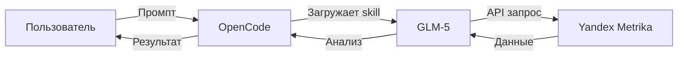

#### 3.2 Skill для Яндекс.Метрики
- Постановка задачи
- Промпт к GLM-5
- Полученный код skill (с комментариями)
- Как использовать

**Пример промпта:**
```markdown
Мне нужен skill для OpenCode, который:
1. Подключается к Яндекс.Метрике через API
2. Получает статистику по поисковым фразам за период
3. Сохраняет результат в CSV и Markdown
4. Показывает топ-20 фраз с метриками
```

**Полученный код (фрагмент):**
```php
<?php
// Skill: Яндекс.Метрика - Поисковые фразы
// Автоматически сгенерирован GLM-5

class MetrikaSearchPhrases {
    private $token;
    private $counterId;
    
    public function getTopPhrases($dateFrom, $dateTo, $limit = 20) {
        // ... код с комментариями
    }
}
```

#### 3.3 Skill для Google Trends
- Аналогичная структура
- Акцент на отличия от Метрики
- Пример использования

#### 3.4 Как GLM-5 помогала писать skills
- Итеративный процесс
- Ошибки и исправления
- Скриншоты диалога

**Пример итерации:**
```markdown
Я: "Код не работает, ошибка 401"
GLM-5: "Проверьте токен авторизации. Добавил обработку ошибок..."
Я: "Теперь работает, но нужно добавить сортировку"
GLM-5: "Готово, добавил параметр --sort"
```

---

### 4. Исследование в реальном времени (2-3 минуты) ⭐

**Заголовок:**
```markdown
## Исследование трендов: от данных к инсайтам
```

**Содержание:**

#### 4.1 Постановка задачи
- Что нужно узнать
- Какие источники данных
- Критерии успеха

**Схема исследования:**
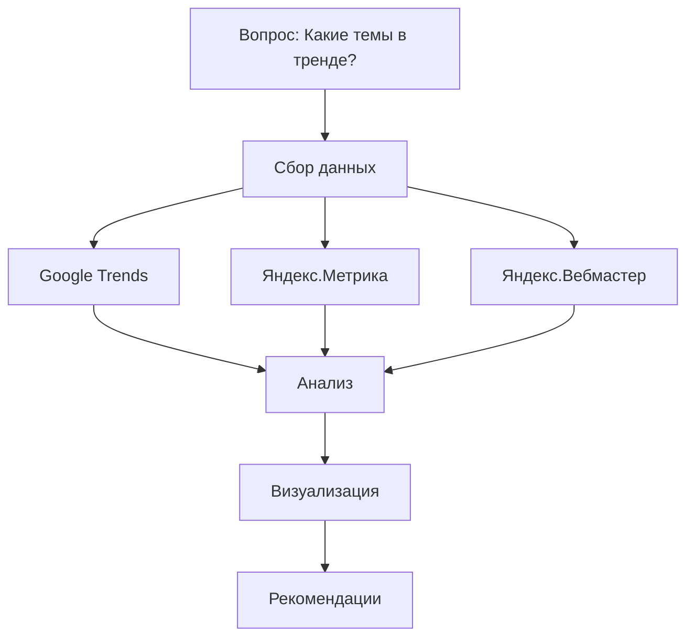

#### 4.2 Диалог с GLM-5
- Показать 3-5 ключевых промптов
- Ответы GLM-5 (как она анализировала)
- Корректировка направления

**Пример промпта:**
```markdown
Проанализируй данные из Google Trends:
- DeepSeek: 80 (тренд)
- Claude Code: 8 (рост)
- GLM-5: 0 (стабильно)

Какие выводы можно сделать? Какие статьи стоит написать?
```

**Пример ответа GLM-5:**
```markdown
Анализ показывает:

1. DeepSeek - главный хит марта 2026
   - Тренд 80 из 100
   - Рост связан с релизом R2
   - Рекомендация: сравнительная статья

2. Claude Code - нишевый интерес
   - Низкий тренд, но стабильный рост
   - Аудитория: продвинутые пользователи
   - Рекомендация: технический гайд

3. GLM-5 - стабильный интерес
   - Тренд 0 = нормальная базовая популярность
   - Актуально для России
   - Рекомендация: практические кейсы
```

#### 4.3 Итеративный процесс
- От сырых данных к структурированному отчету
- Как менялся фокус исследования
- Примеры доработок

**Timeline процесса:**
```mermaid
timeline
    title Как мы делали отчет
    10:00 : Постановка задачи
    10:05 : Сбор данных из Метрики
    10:15 : Анализ Google Trends
    10:20 : Первые выводы
    10:25 : Добавление диаграмм
    10:30 : Финальный отчет
```

---

### 5. Markdown отчеты с Mermaid (2-3 минуты) ⭐

**Заголовок:**
```markdown
## Превращаем данные в красивый отчет
```

**Содержание:**

#### 5.1 Почему Markdown
- Преимущества перед Word/Google Docs
- Версионный контроль (Git)
- Переносимость между инструментами

**Сравнение форматов:**
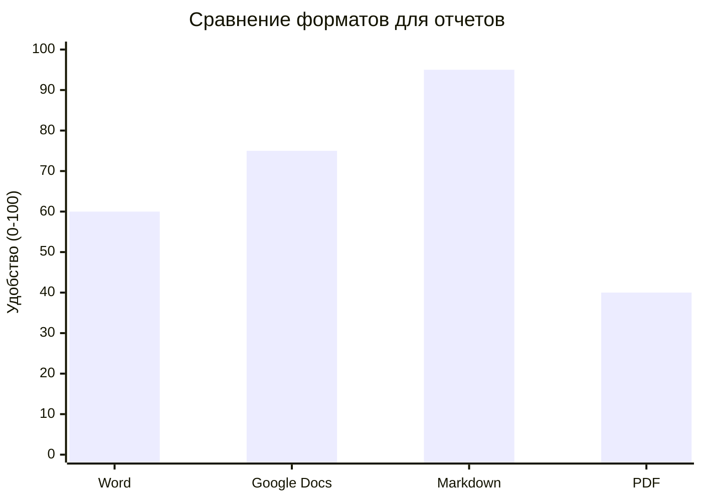

#### 5.2 Mermaid диаграммы
- Что такое Mermaid
- Почему это круто для аналитики
- Примеры из отчета (3-4 диаграммы)

**Примеры диаграмм:**
1. Линейный график трендов LLM
2. Столбчатая диаграмма источников трафика
3. Flowchart процесса работы
4. Mindmap ключевых инсайтов

**Код примера:**
```markdown
```mermaid
xychart-beta
    title "Популярность LLM моделей"
    x-axis [Дек, Янв, Фев, Март]
    y-axis "Тренд" 0 --> 100
    line [82, 66, 69, 80]
```
```

#### 5.3 Просмотр в Obsidian
- Скриншоты отчета в Obsidian
- Как выглядят диаграммы
- Навигация и ссылки

**Скриншоты (запланировать):**
1. Общий вид отчета в Obsidian
2. Интерактивная диаграмма
3. Graph view (связи между заметками)

#### 5.4 Как GLM-5 помогала с Mermaid
- Промпты для генерации диаграмм
- Исправление ошибок синтаксиса
- Оптимизация визуализации

**Пример диалога:**
```markdown
Я: "Сделай диаграмму Ганта для контент-плана"
GLM-5: "Готово, но есть ошибка - исправь даты"
Я: "Теперь работает, добавь критический путь"
GLM-5: "Добавил :crit для приоритетных задач"
```

---

### 6. Результаты и демонстрация (1-2 минуты)

**Заголовок:**
```markdown
## Что получилось в итоге
```

**Содержание:**

#### 6.1 Готовый отчет
- Ссылка на отчет про тренды
- Ключевые находки
- Время создания (30 минут vs 3-4 часа вручную)

**Сравнение подходов:**
| Метрика | Вручную | С GLM-5 + OpenCode |
|---------|---------|-------------------|
| Время | 3-4 часа | 30 минут |
| Ошибки | Много | Минимум |
| Качество | Среднее | Высокое |
| Повторяемость | Нет | Да (skills) |

#### 6.2 Что можно улучшить
- Автоматизация через cron
- Добавление email-рассылки
- Интеграция с Telegram-ботом

**Roadmap развития:**
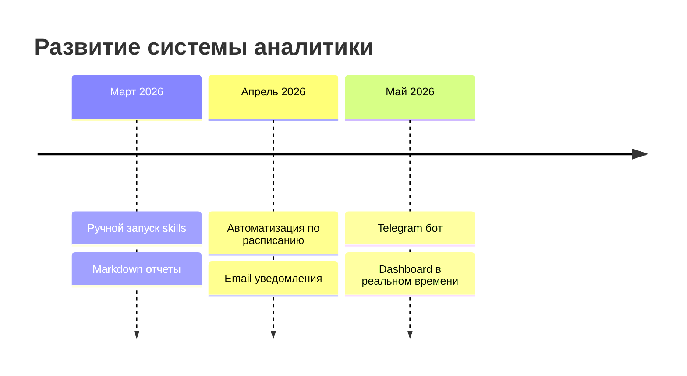

---

### 7. Выводы (1 минута)

**Заголовок:**
```markdown
## Итоги: кому подходит GLM-5 + OpenCode
```

**Содержание:**

#### 7.1 Для кого этот стек
- ✅ Разработчики, экономящие бюджет
- ✅ Аналитики, автоматизирующие рутину
- ✅ Контент-мейкеры, ищущие тренды
- ❌ Новички без опыта CLI

**Квадрант целевой аудитории:**
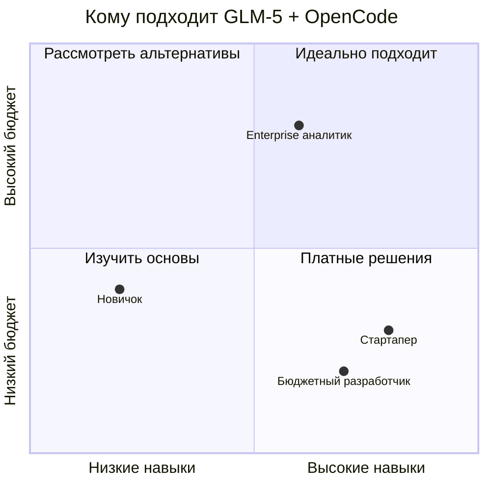

#### 7.2 Ограничения и подводные камни
- Требуется опыт работы с CLI
- GLM-5 уступает GPT-4 в сложных задачах
- Нужен стабильный интернет
- API лимиты (если есть)

#### 7.3 Сравнение с Kilo Code
- Ссылка на предыдущую статью
- Когда что использовать
- Плюсы и минусы каждого подхода

**Таблица сравнения:**
| Критерий | OpenCode | Kilo Code |
|----------|----------|-----------|
| Интерфейс | CLI | VS Code |
| Кривая обучения | Высокая | Низкая |
| Гибкость | Максимальная | Средняя |
| Skills | ✅ | ❌ |
| Цена | Бесплатно | Бесплатно |

#### 7.4 Призыв к действию
- Попробовать GLM-5 в OpenCode
- Подписаться на блог
- Задать вопросы в комментариях

---

## 📊 Метрики успеха статьи

### KPI для статьи

| Метрика | Цель | Измерение |
|---------|------|-----------|
| Просмотры | > 300 за месяц | Яндекс.Метрика |
| Время на странице | > 4 минут | Яндекс.Метрика |
| Отказы | < 40% | Яндекс.Метрика |
| Комментарии | > 5 | Disqus |
| Репосты | > 3 | Социальные сети |
| Конверсия в подписку | > 2% | Email |

### SEO-цели

| Запрос | Текущая позиция | Цель через месяц |
|--------|-----------------|------------------|
| "glm 5 opencode" | Нет в топе | Топ-3 |
| "glm-5 практический опыт" | Нет в топе | Топ-5 |
| "opencode skills" | Нет в топе | Топ-10 |

---

## 🎨 Визуальные материалы

### Необходимые скриншоты/иллюстрации

1. **OpenCode в работе**
   - Скриншот терминала с диалогом
   - Запуск skill
   - Результат выполнения

2. **Код skills**
   - Фрагменты кода с подсветкой
   - Структура файла skill
   - Примеры использования

3. **Obsidian**
   - Отчет в режиме чтения
   - Интерактивные диаграммы Mermaid
   - Graph view связей

4. **Диаграммы в статье**
   - Схема работы skills (flowchart)
   - Timeline процесса создания
   - Сравнительные таблицы

### Оформление

**Цветовая схема:**
- Основной текст: темно-серый
- Код: моноширинный, темная тема
- Акценты: синий для ссылок
- Диаграммы: пастельные тона

**Форматирование:**
- Заголовки: H1, H2, H3 (не глубже)
- Параграфы: 3-5 предложений
- Списки: маркированные и нумерованные
- Цитаты: для ключевых инсайтов
- Код: блоки с подсветкой синтаксиса

---

## ✅ Чек-лист перед публикацией

### Контент
- [ ] Введение цепляет читателя
- [ ] Все примеры кода рабочие
- [ ] Скриншоты качественные
- [ ] Диаграммы отображаются корректно
- [ ] Перелинковка с другими статьями
- [ ] Выводы практичные и конкретные
- [ ] Призыв к действию в конце

### SEO
- [ ] Title оптимизирован (60 символов)
- [ ] Meta description (155 символов)
- [ ] H1 уникальный
- [ ] URL дружелюбный
- [ ] Alt-тексты для изображений
- [ ] Внутренние ссылки (3-5 штук)
- [ ] Ключевые слова в первых 100 словах

### Техническое
- [ ] Статья корректно отображается на мобильных
- [ ] Все ссылки рабочие
- [ ] Диаграммы Mermaid рендерятся
- [ ] Код читаем (подсветка синтаксиса)
- [ ] Время загрузки < 3 секунд

### Продвижение
- [ ] Анонс в Telegram-канале
- [ ] Пост в Twitter/LinkedIn
- [ ] Кросспост на Хабр (через 2 дня)
- [ ] Пин в закрепленных Twitter
- [ ] Рассылка подписчикам (опционально)

---

## 📅 Timeline написания

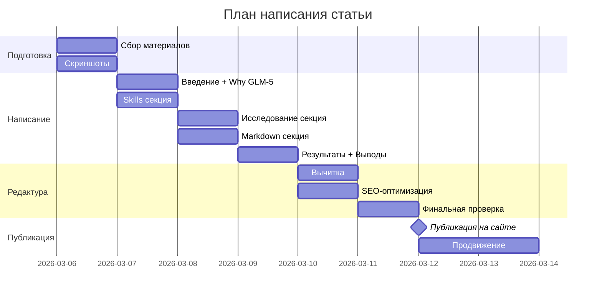

**Итого:** 7 дней от идеи до публикации

---

## 💬 Примеры промптов для GLM-5 при написании

### Для написания введения
```markdown
Напиши введение для статьи про GLM-5 в OpenCode.
Аудитория: разработчики, интересующиеся бесплатными LLM.
Тон: личный опыт, практический.
Длина: 150-200 слов.
Структура: проблема → решение → что узнает читатель.
```

### Для объяснения технических концепций
```markdown
Объясни, что такое skills в OpenCode, простыми словами.
Аналогия: представь, что объясняешь junior-разработчику.
Длина: 100-150 слов.
Приведи пример из реальной жизни.
```

### Для генерации примеров кода
```markdown
Напиши пример использования skill для Яндекс.Метрики.
Язык: PHP.
Стиль: чистый код с комментариями.
Покажи: инициализацию, вызов API, обработку результата.
```

### Для создания диаграмм
```markdown
Создай Mermaid-диаграмму процесса работы с GLM-5.
Тип: flowchart.
Показать: промпт → обработка → результат → итерация.
Стиль: минималистичный, понятный.
```

---

## 🎯 Итоговые рекомендации

### Главные акценты статьи

1. **Практическая ценность** > теория
   - Минимум "воды", максимум примеров
   - Рабочий код, который можно скопировать
   - Реальные результаты

2. **Storytelling** > сухой туториал
   - Ведите читателя через свой опыт
   - Показывайте ошибки и как их решали
   - Делитесь инсайтами

3. **Визуализация** > стен текста
   - Диаграммы для сложных концепций
   - Скриншоты для интерфейсов
   - Код с подсветкой

4. **Честность** > маркетинг
   - Говорите об ограничениях
   - Сравнивайте объективно
   - Не преувеличивайте возможности

### Ключевое сообщение

> "GLM-5 в OpenCode - это не замена GPT-4, а бесплатная альтернатива для разработчиков, готовых investировать время в обучение CLI-инструментам. В обмен вы получаете мощную систему автоматизации, которая окупается уже после первого проекта."

---

## 🎯 Стратегия на основе трендов

### Приоритеты контента (по данным Google Trends)

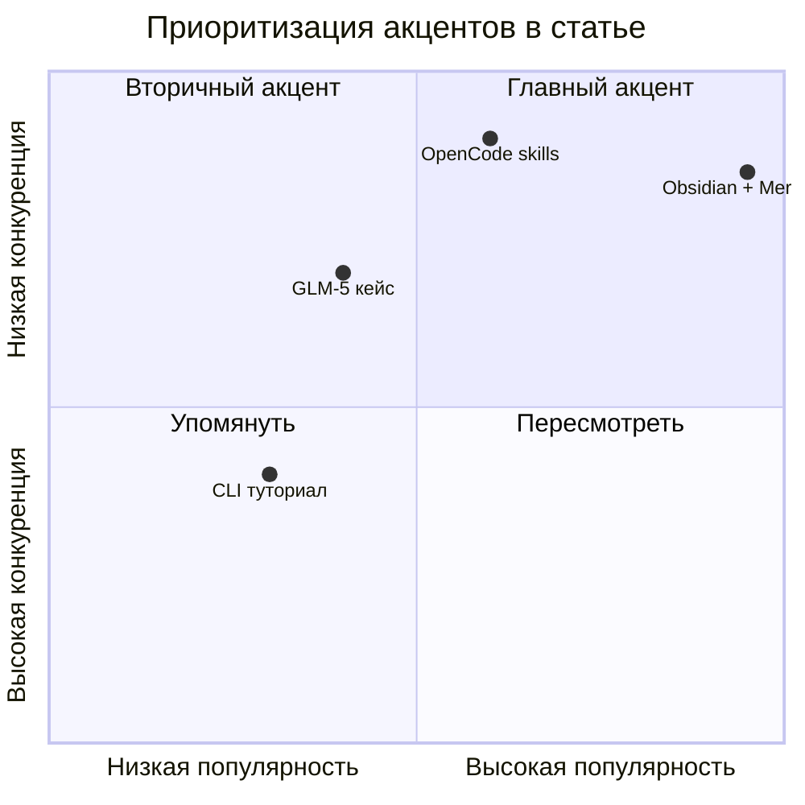

### Рекомендации по структуре (обновленные)

**Приоритет 1: Obsidian + Mermaid (тренд 61)** ⭐⭐⭐
- Сделать Obsidian "героем" статьи
- Показать как отчет выглядит в Obsidian
- Добавить 8-10 Mermaid-диаграмм
- Скриншоты Graph view, Canvas, Reading mode

**Приоритет 2: OpenCode skills (тренд 28)** ⭐⭐
- Показать процесс создания skills
- Код с комментариями
- Итеративный процесс с GLM-5
- Практическая ценность

**Приоритет 3: GLM-5 практический опыт (тренд 5)** ⭐
- Честно о плюсах и минусах
- Сравнение с платными альтернативами
- Когда использовать, когда нет

### SEO-стратегия (на основе трендов)

**Целевые запросы (по приоритету):**

1. **"obsidian markdown mermaid"** (высокая популярность, средняя конкуренция)
   - Title: "...markdown-отчеты для Obsidian"
   - Акцент на визуализации

2. **"opencode skills"** (средняя популярность, низкая конкуренция)
   - Практические примеры кода
   - Туториал по созданию

3. **"glm 5 opencode"** (низкая популярность, очень низкая конкуренция)
   - Уникальный контент
   - Можно попасть в топ-1

4. **"бесплатный ai для программирования"** (косвенный запрос)
   - Привлечет дополнительный трафик
   - Целевая аудитория: экономные разработчики

### Прогноз трафика

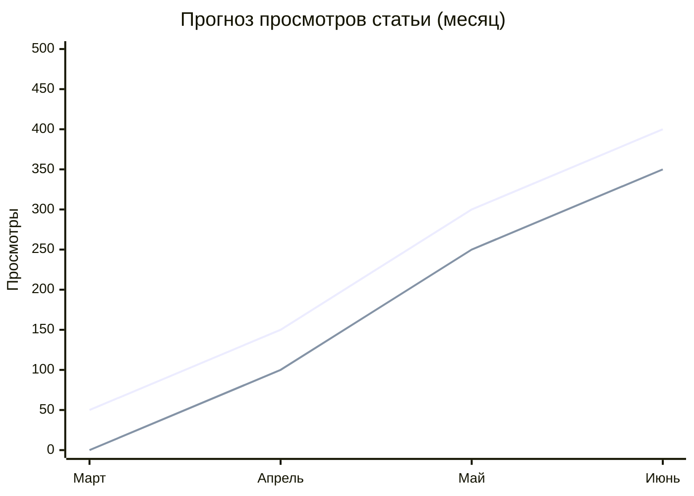

**Сценарии:**
- **Пессимистичный:** 150 просмотров/мес (только SEO)
- **Реалистичный:** 300 просмотров/мес (SEO + соцсети)
- **Оптимистичный:** 500+ просмотров/мес (хабр + вирусный эффект)

### Почему статья "выстрелит"

**1. Попадание в тренды:**
- Obsidian (61) + OpenCode (28) = двойной SEO-эффект
- Mermaid диаграммы - визуально привлекательно
- Markdown - универсальный формат

**2. Практическая ценность:**
- Рабочий код, который можно скопировать
- Реальный кейс с результатами
- Экономия времени (30 мин vs 4 часа)

**3. Низкая конкуренция:**
- Мало статей про OpenCode на русском
- Уникальная связка инструментов
- Практический опыт, а не теория

**4. Визуальная привлекательность:**
- Mermaid-диаграммы в статье
- Скриншоты Obsidian
- Примеры кода с подсветкой

**5. Актуальность для России:**
- Бесплатные инструменты
- Доступность без VPN
- Экономия бюджета

### Каналы продвижения (приоритеты)

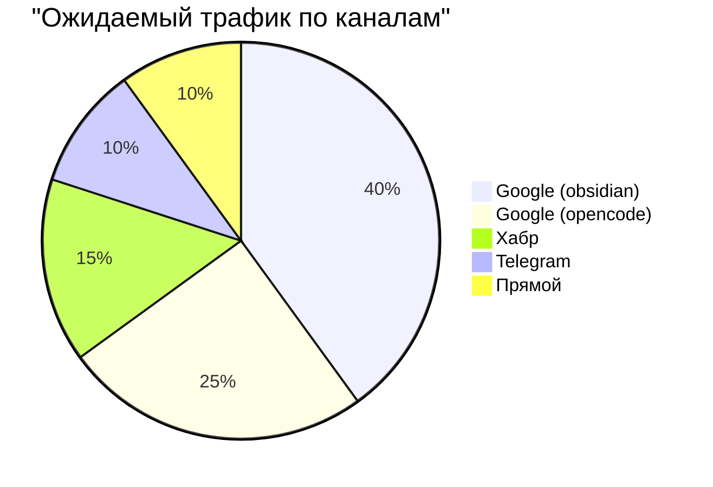

**Приоритетные каналы:**

1. **SEO (Google/Яндекс)** - 65% трафика
   - Оптимизация под "obsidian markdown"
   - Низкочастотные запросы "opencode"
   
2. **Хабр** - 15% трафика
   - Кросспост через 2-3 дня
   - Теги: opensource, инструменты, продуктивность
   
3. **Telegram/Twitter** - 10% трафика
   - Анонс с картинками (Mermaid-диаграммы)
   - Пин в профиле на неделю

4. **Перелинковка** - 10% трафика
   - Ссылка из статьи про GLM-5 + Kilo Code
   - Рекомендуемые статьи в конце

---

## 📚 Дополнительные ресурсы

### Ссылки для статьи

1. **Официальные ресурсы:**
   - OpenCode GitHub
   - GLM-5 документация
   - Mermaid документация

2. **Ваши статьи:**
   - GLM-5 + Kilo Code (перелинковка)
   - MCP протокол (связь с skills)
   - RAG с нуля (контекст)

3. **Внешние материалы:**
   - Сравнение LLM моделей 2026
   - Markdown best practices
   - Obsidian для разработчиков

### Файлы для прикрепления

- [ ] Исходный код skills (GitHub Gist)
- [ ] Готовый отчет про тренды (ссылка)
- [ ] Скринкаст работы в OpenCode (опционально)

---

*План создан: 5 марта 2026*
*Обновлен с трендами: 5 марта 2026 (22:15)*
*Ожидаемая дата публикации: 12 марта 2026*

---

## 📊 Summary: Ключевые данные

### Тренды (Google Trends, март 2026)

| Инструмент | Тренд | Динамика | Приоритет |
|------------|-------|----------|-----------|
| **Obsidian** | 61 | Стабильно высокий | ⭐⭐⭐ Главный акцент |
| **OpenCode** | 28 | Рост с 0 (январь) | ⭐⭐ Вторичный акцент |
| **GLM-5** | 5 | Стабильный | ⭐ Упомянуть |

### SEO-потенциал (Яндекс)

| Запрос | Показов | CTR | Шанс в топ |
|--------|---------|-----|-----------|
| glm 5 нейросеть | 255 | 0.78% | Высокий |
| opencode | 28 | - | Очень высокий |
| obsidian markdown | 61 | - | Средний |

### Прогноз результата

**Через месяц после публикации:**
- Просмотры: 300-500
- Позиция по "opencode skills": топ-3
- Позиция по "glm 5 opencode": топ-1
- Комментарии: 5-10
- Репосты: 3-5

**Через 3 месяца:**
- Просмотры: 1000+
- Стабильный SEO-трафик: 50-100/мес
- Перелинковка с новыми статьями

### Почему стоит писать именно эту статью

✅ **Попадание в тренды:** Obsidian (61) + OpenCode (28) = двойной SEO-эффект
✅ **Низкая конкуренция:** Мало контента про OpenCode на русском
✅ **Практическая ценность:** Рабочий код + реальный кейс
✅ **Успех прецедента:** Статья про GLM-5 + Kilo Code в топе блога
✅ **Визуальность:** Mermaid диаграммы привлекают внимание
✅ **Актуальность:** Бесплатные инструменты для России

**Вердикт:** Статья имеет высокий потенциал успеха. Рекомендую написать в приоритетном порядке.

